# 	      MSFin SmartLink Code Sample

**Table of contents**

[Prerequisites](#prerequisites)

[Register the application in Azure Active Directory for MVC web app](#register-the-application-in-azure-active-directory-for-mvc-web-app)

[Register the application in AAD for web job](#register-the-application-in-aad-for-web-job)

[Create Azure resources using ARM template](#create-azure-resources-using-arm-template)

[Configure the communication between web job and O365 tenant](#configure-the-communication-between-webjob-and-o365-tenant)

[Deploy the sample to Azure](#deploy-the-sample-to-azure)

[Upload the Excel & Word manifest files](#upload-the-excel--word-manifest-files)

[Install Excel Add-in](#install-excel-add-in)

[Install Word Add-in](#install-word-add-in)

[Run Excel & Word Add-ins](#run-excel--word-add-ins)

[How to view Azure SQL data?](#How-to-view-azure-sql-data?)

[How to view data in the storage account?](#how-to-view-data-in-the-storage-account)

[How to check WebJob status?](#How-to-check-webjob-status?)

[Build and debug locally](#build-and-debug-locally)

[Understand the code](#understand-the-code)

[Questions and comments](#questions-and-comments)

[Contributing](#contributing)

## Prerequisites

**Deploying and running this sample requires**:

1. An Azure subscription with permissions to register a new application, and deploy the web app.
2. You have O365 account and you could contact your admin to consent the permission to access it.
3. Visual Studio 2015 (any edition), [Visual Studio 2015 Community](https://go.microsoft.com/fwlink/?LinkId=691978&clcid=0x409) is available for free and ensure Latest Microsoft Office Developer Tools for Visual Studio 2015 is installed.
4. Make sure you have [Outlook 2016](https://products.office.com/en-US/outlook/email-and-calendar-software-microsoft-outlook) installed.
5. Familiarity with C#, .NET Web applications, JavaScript programming.

## Register the application in Azure Active Directory for MVC web app

1. Login the Azure AD using the O365 account. ([`https://manage.windowsazure.com`](https://manage.windowsazure.com)) 

2. Click *Active Directory* on the left navigation

   

3. Click on the name of your Azure AD directory & then click *Applications* in the tabs menu.

   > **Note:** A new active directory needs to be created if no one exists.

   

4. Click *Add an application my organization is developing* in the popup.

5. In the Add Application wizard, enter a name of *SmartLink.Web* and choose the type *Web Application and/or Web API*. Click the arrow to the next page of the wizard.

6. In the *App Properties* page, enter a *SIGN-ON URL*

   `https://<websitename>.azurewebsites.net`

7. Enter an *App ID Uri* `https://[your-domain\].onmicrosoft.com/<websitename>`

8. Hit Ok to create the registration.

9. Obtain and store the Azure AD tenant ID.

   - Click *VIEW ENDPOINTS* in the bottom tabs.
   - The GUID after *`Login.microsoftonline.com/`* is the tenant ID and store it.

10. Store the copied client secret.

   - On the application,  click *‘All Settings’* | Keys then fill the key description and copy the value.
   - Store the copied client secret.

11. Store the application client ID

    - On the application, Quick Start page, click on *CONFIGURE* in the tabs menu.
    - Search & copy the Client ID value and store it.


## Register the application in AAD for web job

Follow [Register the application in AAD for MVC WEB APP](#register-the-application-in-azure-active-directory-for-mvc-web-app) section to register another app named *smartlink.webjob* and please refer to the table below when fill the value. 

| SIGN-ON URL    | https://<websitename>.azurewebsites.net  |
| -------------- | ---------------------------------------- |
| **App ID Uri** | **https://[your-domain].onmicrosoft.com/<webjobname>** |

Here are the app permissions needed for the Azure AD app *smartlink.webjob*.


## Create Azure resources using ARM template

1. Download the project and using visual studio 2015 to open it.

2. Right click on the Azure resource group project *SmartLink.Azure* and click *Deploy* | *New*.

   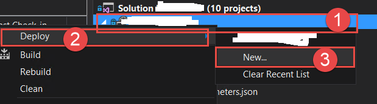

3. Fill the Azure login account and create a new resource group (**For example:**
   *SmartLink.QA*) then select the resource parameter json file (**For example:** *resource.qa.parameters.json*) & edit the parameter.

   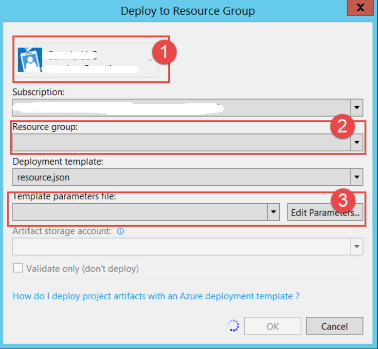

4. After clicking *Edit Parameters* and please fill the parameters below.

   

   > **Note:** Please select the checkbox to store the password as plain text in the parameters file.

   | **Parameter Name**            | **Value**                                | **Note**                                 |
   | ----------------------------- | :--------------------------------------- | ---------------------------------------- |
   | webSiteName                   | <WebSiteName>  **For example:** *SmartLinkQAWebApp* |                                          |
   | sqlserverName                 | <SQLServerName>  **For example:**  *SmarkLinkQASQL* | The SQL server name                      |
   | hostingPlanName               | <hostingPlanName>  **For example:**  SmartLinkQAHostPlan | The name of the App Service plan to use for hosting the web app. |
   | skuName                       | <skuName>  **For example: **  F1         |                                          |
   | skuCapacity                   | <skuCapacity>  **For example:**  1       | sets number of workers for this App Service plan SKU |
   | administratorLogin            | <administratorLogin>  **For example:**  SmartLinkLogin | This login is used to login to the SQL database. |
   | administratorLoginPassword    | < administratorLoginPassword >  **For example:** smartlink@qa |                                          |
   | databaseName                  | <databaseName>  **For example:**  SmartLinkQA | The database name hosted on the SQL server |
   | collation                     | Leave it as is.                          |                                          |
   | edition                       | <Edition>  For example: basic            | Specifies the edition for the database. Valid values are:   -- Default  -- None  -- Premium  -- Basic  -- Standard |
   | maxSizeBytes                  | Leave it a is                            |                                          |
   | requestedServiceObjectivename | <requestedServiceObjectivename>          | performance level                        |
   | storageAccountType            | <storageAccountType>  **For example:**  Standard_LRS |                                          |
   | storageAccountName            | <storageAccountName>  **For example:**  SmartLinkQA |                                          |
   | appInsightName                | <appInsightName>  **For example:**  msfinsmartlinkqa |                                          |

5. Validate and hit Ok.

   

6. Uncheck the *Validate only* checkbox andthen hit OK to create the Azure resources.

   | **Resource Name**    | **Resource Type**   | **Pricing Level** | **Resource Group**                       |
   | -------------------- | ------------------- | ----------------- | ---------------------------------------- |
   | <WebSiteName>        | App Service         | F1                | Resource group created in the step 3 above. |
   | <SQLServerName>      | SQL Server          | N/A               | Same as above                            |
   | <databaseName >      | SQL database        | basic             | Same as above                            |
   | <storageAccountName> | Storage  account    | LRS               | Same as above                            |
   | <WebSiteName>        | Application insight | basic             | Same as above                            |

   ​

## Configure the communication between webjob and O365 tenant

1. Create self-certificate.

   - Execute the following command to create the self-certificate. 

     `makecert -n "CN=MyCompanyName MyAppName Cert" -ss my -len 2048`

   - Go to the personal certificate store under current user. 

   - Export the CER certificate with base 64 encoded X.509.

     

   - Execute the following PowerShell command.

     ```powershell
     $cer = New-Object System.Security.Cryptography.X509Certificates.X509Certificate2
     $cer.Import("<absolute path of the CER file> Example c:\mycert.cer>") 
     $bin = $cer.GetRawCertData()
     $base64Value = [System.Convert]::ToBase64String($bin)
     $bin = $cer.GetCertHash()
     $base64Thumbprint = [System.Convert]::ToBase64String($bin)
     $keyid = [System.Guid]::NewGuid().ToString()
     ```

   - Store the base64Value; $base64Thumbprint; keyid that will be used in other places.

     > **Note:** **If MAKECERT is not available, please download the windows SDK and install the tool only in the screenshot below.**

     [https://www.microsoft.com/en-us/download/confirmation.aspx?id=8279](https://www.microsoft.com/en-us/download/confirmation.aspx?id=8279)

     

2. Export PFX certificate

   - Export the PFX certificate from the self-certificate (remember to export with the private key)
   - Store the password when export the PFX certificate.
   - Store the PFX certificate. 

3. Download the project & include the certificate. 

   - Open the solution.
   - Include the PFX certificate in SmartLink.WebJob project. 

   **For example:** smartlinkqa.pfx.

4. Configure the app settings in Azure portal

   - Go to the application settings.

   - Locate the App settings node.

     

   - Fill the following app settings.   

   | **App  setting **   | **Value**                                | **Notes**                                |
   | ------------------- | ---------------------------------------- | :--------------------------------------- |
   | InstrumentationKey  | Application Insight Instrumentation key. | Find it in the application insights      |
   | ida:WebJobClientId  | The application ID of the AAD App for  WEB JOB | Find it in the AAD App for web job.      |
   | CertificatePassword | The password when export the  certificate | Step 2 in this [section](#configure-the-communication-between-webjob-and-o365-tenant) |
   | ida:AADInstance     | [https://login.microsoftonline.com/](https://login.microsoftonline.com/) | Fixed value                              |
   | ida:TenantId        | The Azure Tenant ID                      | Step 9 in this [section](#register-the-application-in-azure-active-directory-for-MVC-web-app) |
   | SharePointUrl       | The root site collection of the O365    site | **For example:**  [https://yourtenant.sharepoint.com](https://yourtenantsharepoint.com) |
   | CertificateFile     | web site relative path                   | **For example:**  smartlinkqa.pfx        |

5. Update the manifest file.

   - Download the manifest file from the AAD app forthe web job.
   - Edit XXX following the template below
   - Upload the manifest file

| **Key**             | **Value**         | **Notes**                                |
| ------------------- | ----------------- | ---------------------------------------- |
| customKeyIdentifier | $base64Thumbprint | Step 1.5 in this [section](#configure-the-communication-between-webjob-and-o365-tenant). |
| keyId               | $keyid            | Step 1.5 in this [section](#configure-the-communication-between-webjob-and-o365-tenant). |
| value               | $base64Value      | Step 1.5 in this [section](#configure-the-communication-between-webjob-and-o365-tenant) |


## Deploy the sample to Azure

1. Open the project using visual studio 2015 if you already download it. 
2. Update the configuration settings in the table below.

| App Setting               | Value                                 | Note                                     |
| ------------------------- | ------------------------------------- | ---------------------------------------- |
| ida:clientID              | GUID                                  | Step 10 in this [section](#register-the-application-in-azure-active-directory-for-MVC-web-app) |
| ida:clientSecret          | String                                | Step 11 in this [section](#register-the-application-in-azure-active-directory-for-MVC-web-app) |
| ida:TenantID              | GUID                                  | Step 9 in this [section](#register-the-application-in-azure-active-directory-for-MVC-web-app) |
| ida:domain                | yourtenantname.onmicrosoft.com        |                                          |
| ida:PostLogoutRedirectUri | https://websitename.azurewebsites.net | Azure web site URL                       |
| ResourceId                | https://graph.microsoft.com           | this is fixed value                      |
| ConsentResource           | https://yourtenantname.sharepoint.com |                                          |

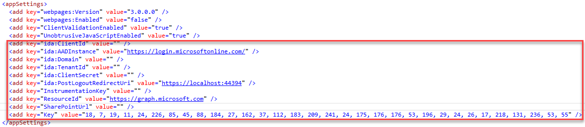

3. Right click on *SmartLink.Web* and then select *'Publish'*

4. A *Publish* popup will be displayed.

5. Click on *Microsoft Azure App Service.*

6. Sign in with Azure account and select the Azure website then click '*Next*'

7. Select Web Deploy and then click *'Next'*

8. Select Debug and click *'Next'*

   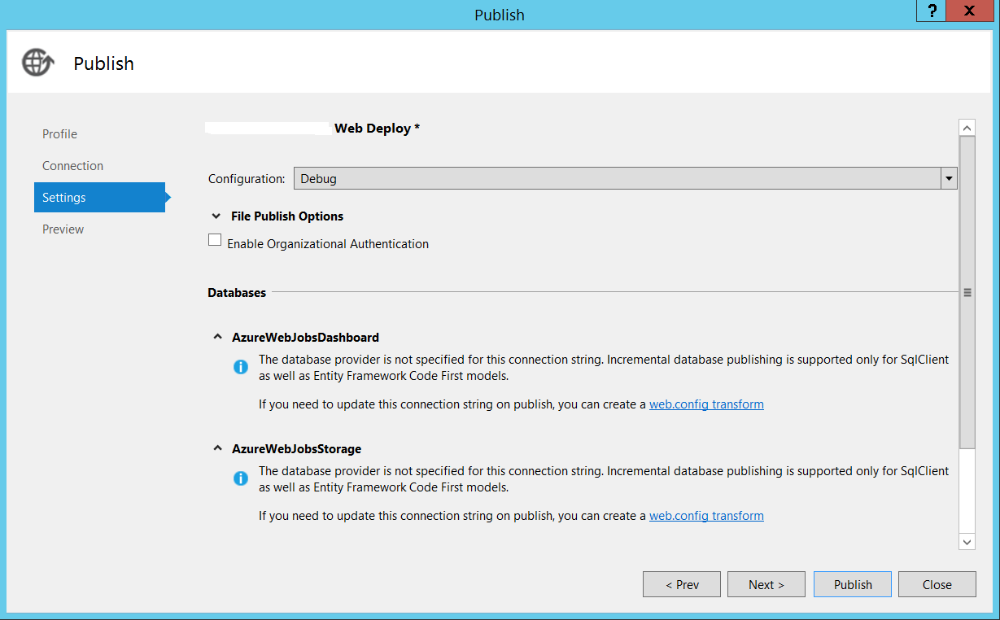

9. Click *'Publish'*

## Upload the Excel & Word manifest files

1. Go to the app for office add-in management page. 

   **For example:** `https://<tenantname>.sharepoint.com/sites/AppCatelog/AgaveCatalog/Forms/AllItems.aspx` 

2. Click *'Upload'*

   

3. Find the excel [app manifest file](SmartLinkExcel/SmartLinkExcelManifest/SmartLinkExcel.xml) & word [app manifest file](SmartLinkWord/SmartLinkWordManifest/SmartLinkWord.xml)

4. Update the excel & word manifest files.

   - Update the Id with a new generated GUID and you could refer to the link below on how to generate it. [https://guidgenerator.com/online-guid-generator.aspx](https://guidgenerator.com/online-guid-generator.aspx) 

     > Note: please generate new GUID for the word manifest file.

   - Update the source location default value to the one provisioned in Azure.

     **For example:** `[https://<yourwebsitename>.azurewebsites.net/Home/Index](https://msfinsmartlinkqa.azurewebsites.net/Home/Index)` 

     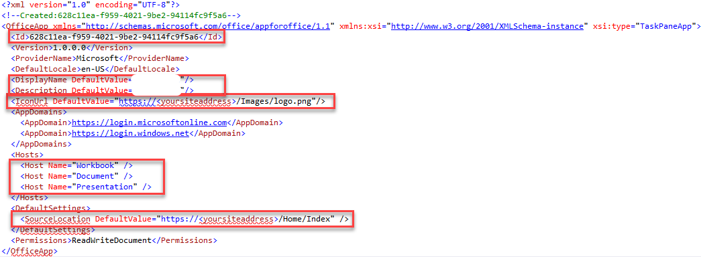

5. Upload manifest file *SmartLinkExcel.xml* & *SmartLinkWord.xml* to the SharePoint catalog.

## Install Excel Add-in

1. Open Excel 2016.

2. Sign in with O365 account. 

3. Click *File* | *Options*

   

4. Click Trust Center | Trust center settings.

   

5. Click *Trusted Add-in Catalogs* | Add catalog URL.

   **For example:** `https://<tenantname>.sharepoint.com/sites/AppCatelog`

   

6. Restart the excel.

7. Click *Insert* and *My Add-ins*

   

8. Click *MY ORGANIZATION* and insert the *SmartLinkExcel*. 

   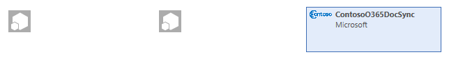

9. Then the Excel Add-in would be shown on the task panel.

   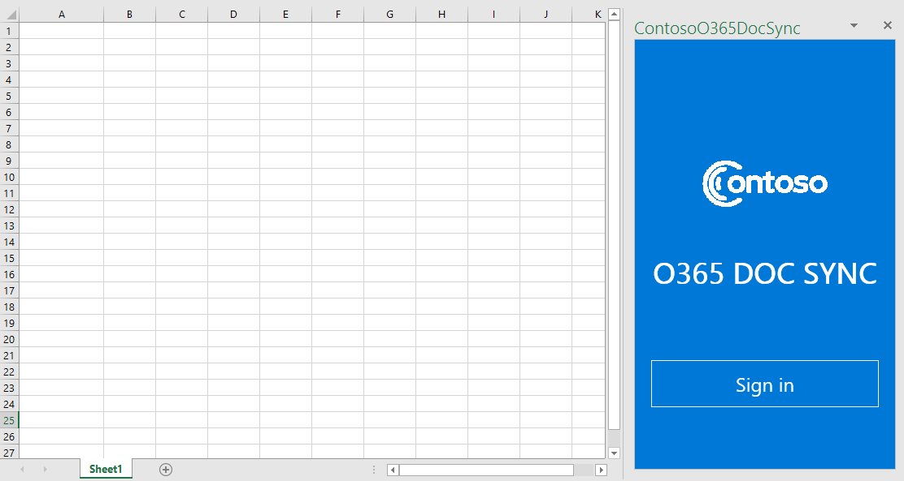

## Install Word Add-in

1. Open Word 2016

2. Sign in with O365 account. 

3. Click *File* | *Options*

4. Click *Trust Center* | *Trust center settings*.

   

5. Click *Trusted Add-in Catalogs* | Add catalog URL

   **For example:** `https://<tenantname>.sharepoint.com/sites/AppCatelog`

6. Restart Word.

7. Click *Insert* and *My Add-ins*.

8. Click *MY ORGANIZATION* and insert the *SmartLinkWord*.

9. Then the Word Add-in would be shown on the task panel.


## Run Excel & Word Add-ins

1. Work with your O365 admin to go to admin consent page in the browser. 

   **For example:** `https://<yourwebsitename>.azurewebsites.net/Admin/Consents`

2. Ensure the webjob is running status. Please refer to this [section](#How-to-check-WebJob-status?) on how to check the WebJob status.

3. Use the O365 admin account to login and click admin consent button. 

   

4. Accept the permissions to access SharePoint site. 

   

5. Open the excel stored in your O365 document library and open it using excel client tool then enable editing the excel and open the excel add-in. 

   

   ​

6. Use your O365 account to login the excel add-in and create a source point 

   - Click add button.

   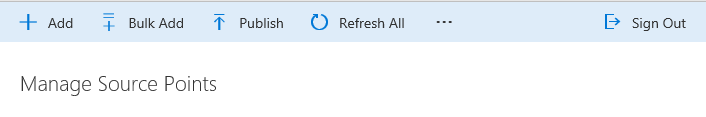

   - Edit the source point form.

     - Fill the Source Point name
     - Select group
     - Select the range (only one cell is supported, please do not double click the cell.  Click Esc if double click the cell.)
     - Click the populating cell address button
     - Save the changes

     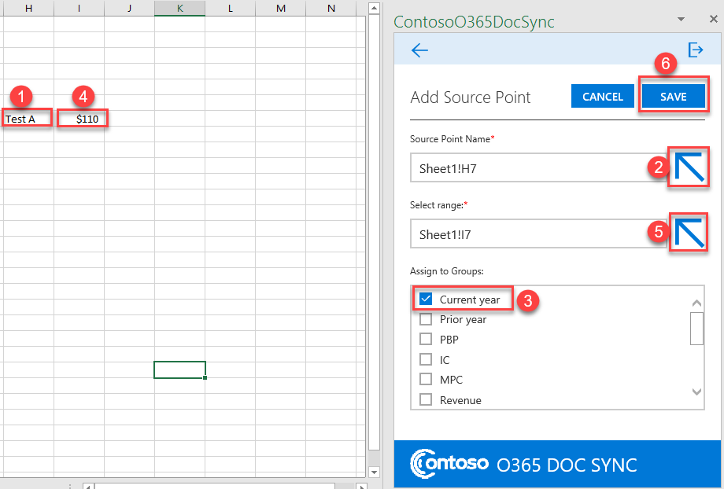

7. Open a word document under the same document library where excel file hosted in O365 site.

8. Use your O365 account to login the word add-in and create a destination point.

   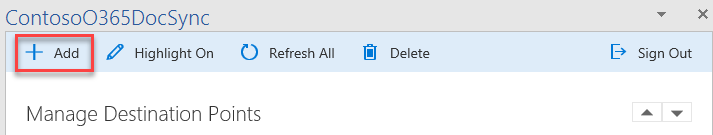


8. Select the excel file hosts the source points and select one source point. 

   


9. Put the cursor in the word before clicking the add button.

   

   10. Save the word document and close it. 
   11. You could refer to the 2 section on [how to view the SQL data](#how-to-view-azure-sql-data) and [how to view data in the storage account](#how-to-view-data-in-the-storage-account?).

## How to view Azure SQL data?

1. Login the Azure portal. [https://portal.azure.com](https://portal.azure.com) 

2. Select the SQL Server created in this [section](#create-azure-resources-using-arm-template).

3. Click "Show firewall settings".

   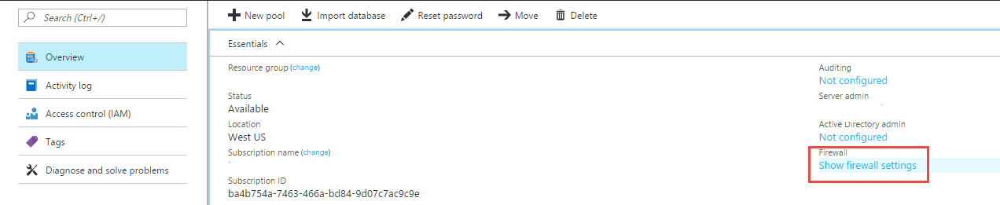

4. Add the client IP and save it.

   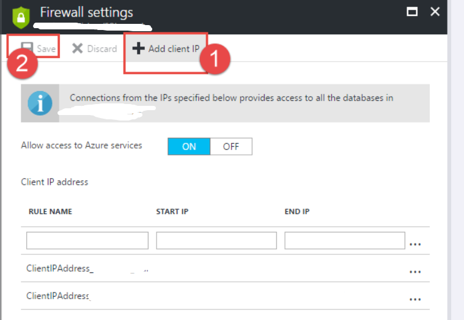

5. Open Visual Studio 2015 with administrator permission and open "SQL Server Object explorer"

   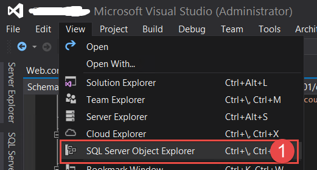

6. Select database and connect it.

   - The Server name will be automatically filled after selecting the DB.

   - Fill the correct DB.

   - Fill the correct Authentication Type, *Sql Server Authentication.*

   - Fill the User Name/Password created in this [section](#create-azure-resources-using-arm-template).

   - The Database Name  will be automatically filled.

     

   - Expand the tables under the database. 

     

   - View the table data by clicking view data.

     

   ​

## How to view data in the storage account? 

1. Login the Azure portal. [https://portal.azure.com](https://portal.azure.com) 

2. Select he storage account created in this [section](#create-azure-resources-using-arm-template).

3. Get the access keys.

   - Select Access keys under the settings in the storage account.

     

   - Copy/Store the access key. 

     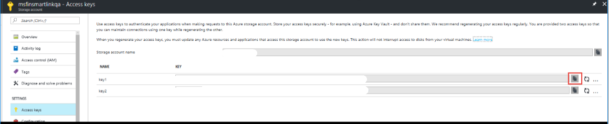

4. Download the Azure Storage explorer.

   - Download the azure storage explorer from the following location [http://storageexplorer.com](http://storageexplorer.com)

     ​

5. Use the API key to connect the storage account in Azure explorer.

   - Connect to Azure storage.

     

   - Copy the access key from the step 3 above and paste into textbox below.

     

   - Fill the storage account name (**For example: **msfinsmartlinkqa)

     

6. Check the queue/table.

   - The publsihqueue & publish table is created under the queues/tables.

      

   - Check the data in the queue.

      If there is one item in queue, then there is one source point that needs to be proceeded. 

   - Check the data in the table.

      If the status value is InProgess, it means the item is still processing. (UI shows the progress bar)

      If the status value is Completed, it means the item is proceed completed(UI shows the notification saying process succeeded)

      If the status value is error, it means there is some error processing this item(UI shows the error notification.)

   

   ​

## How to check WebJob status?

1. Login the Azure portal. [https://portal.azure.com](https://portal.azure.com)

2. Select website created in this [section](#create-azure-resources-using-arm-template). 

3. Go to the *WebJobs* under the website.

   


4. Ensure the WEBJOB status is running.

   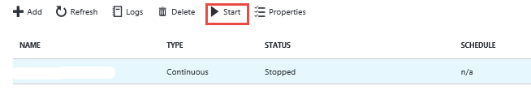

   

## Build and Debug locally

1. Open the project using Visual Studio 2015 if you already download it. 

2. Set as debug mode for the project.

   

3. Build the project and make sure all projects build succeeded. 

   

4. Create a new Azure AD App for the web.

   - Please use the value of SIGN-ON URL & App ID Uri below when follow the section [Register the application in Azure Active Directory for MVC web app](#register-the-application-in-azure-active-directory-for-MVC-web-app) to create a new Azure AD app.  

     | SIGN-ON URL    | https://localhost:44394/     |
     | -------------- | ---------------------------- |
     | **App ID Uri** | **https://localhost:44394/** |

   - Make sure you would get the Tenant ID, Client ID, Client Secret. 

5. Update the [web.config](SmartLink.Web/Web.config).

   | App setting key           | Value                                    | Update [web.config](SmartLink.Web/Web.config) or not | Update [web.debug.config](SmartLink.Web/Web.Debug.config) or not |
   | ------------------------- | ---------------------------------------- | ---------------------------------------- | ---------------------------------------- |
   | ida:ClientId              | Client ID value get from step 4          | Yes                                      | Yes                                      |
   | ida:TenantId              | Tenant ID value get from step 4          | Yes                                      | No                                       |
   | ida:ClientSecret          | Client Secret value get from step 4      | Yes                                      | No                                       |
   | ida:PostLogoutRedirectUri | https://localhost:44394/                 | Yes                                      | Yes                                      |
   | ConsentResource           | `https://<yourtenantname>.sharepoint.com` | Yes                                      | No                                       |

6. Update the JavaScript file to support the local debug for excel add-in.

   - Open the [SignIn.js](SmartLink.Web/Scripts/App/SignIn.js) and update the isDev property value from false to true.

   - Make sure that an excel file is uploaded to the document library in SharePoint site within your tenant. 

   - Copy the excel file link and update link in [Point.js](SmartLink.Web/Scripts/App/Excel/Point.js) in line 45

   - Find the disk drive where solution hosts (**For example:** E disk) and update E: to that disk drive in [Point.js](SmartLink.Web/Scripts/App/Excel/Point.js) in line 45.

     ```javascript
      that.filePath = Office.context.document.url.indexOf("E:") > -1 ? "https://<yourtenantname>.sharepoint.com/Shared%20Documents/Book.xlsx" : 
     ```

7. Set SmartLinkExcel as StartUp project, and press F5.

   - Work with your O365 admin to go to admin consent page in the browser. 

     **For example:** `https://localhost:44394/Admin/Consents`

   - Use the o365 admin account to login and click admin consent button. 

   - Accept the permissions to access SharePoint site. 

   - Open the excel add-in in your local.

   - Click *add* and edit the source point form.

     - Fill the Source Point name

     - Select group

     - Select the range (only one cell is supported, please do not double click the cell.  Click Esc if double click the cell.)

     - Click the populating cell address button

     - Save the changes

       

     > **Note:** By default, you could debug the JavaScript file by setting the break point in it.You could also attach the process to debug the web application code when click save.  

     

     ​

8. Set SmartLinkWord as StartUp project and press F5

   - Open the words add-in in your local.

   - Click add and edit the destination form.

   - Select the excel file hosts the source points and select one source point just created. 

   - Put the cursor in the word before clicking the add button.

   - Click Add to add the destination point.

     


## Understand the code

### Excel Data Flow


### Word Data Flow:


### Components:

1. Web Project SmartLink.Web

   - SourcePoint Controller

     `SmartLink.Web\Controllers\SourcePointController.cs`

     - Create source point:

       ```c#
       [HttpPost]
       [Route("api/SourcePoint")] 
       public async Task<IHttpActionResult> PostAsync([FromBody]SourcePointForm sourcePointAdded)
       ```

     - Get source point

       ```c#
       [HttpDelete]
       [Route("api/SourcePoint")]
       public async Task<IHttpActionResult> DeleteSourcePointAsync(string id)
       ```

     - Update source point

       ```c#
       [HttpPut]
       [Route("api/SourcePoint")]
       public async Task<IHttpActionResult> EditSourcePointAsync([FromBody]SourcePointForm sourcePointAdded)
       ```

     - Delete source point

       ```c#
       [HttpPost]
       [Route("api/DeleteSelectedSourcePoint")]
       public async Task<IHttpActionResult> DeleteSelectedSourcePointAsync([FromBody]IEnumerable<Guid> seletedIds)
       ```

   -  DestinationPoint controller

     `SmartLink.Web\Controllers\DestinationPointController.cs`

     - Create destination point.

       ```c#
       [HttpPost]
       [Route("api/DestinationPoint")]
       public async Task<IHttpActionResult> Post([FromBody]DestinationPointForm destinationPointAdded)
       ```

     - Get destination point

       ```c#
       [HttpGet]
       [Route("api/DestinationPoint")]
       public async Task<IHttpActionResult> GetDestinationPointBySourcePoint(string sourcePointId)
       ```

     - Delete destination point

       ```C#
       [HttpDelete]
       [Route("api/DestinationPoint")]
       public async Task<IHttpActionResult> DeleteSourcePoint(string id)
       ```

     - Get Graph access token

       ```c#
       [HttpGet]
       Route("api/GraphAccessToken")]
       public async Task<IHttpActionResult> GetGraphAccessToken()
       ```

       ​

   - Authentication

     - Open ID Authentication 

       `SmartLink.Web\App_Start\Startup.Auth.cs`

     - Get graph token.

     ```c#
     AuthenticationResult result = authContext.AcquireTokenByAuthorizationCode(code, redirectUrl, credential, resourceId);
     AuthenticationHelper.token = result.AccessToken;
     ```

     ​

2. Service project SmartLink.Service

   - SmartLink DB context

     `SmartLink\SmartLink.Service\SmartlinkDbContext.cs`

   - SourcePoint Service

     `SmartLink\SmartLink.Service\SourcePointService.cs`

     - Create source point

       ```c#
       public async Task<SourcePoint> AddSourcePointAsync(string fileName, SourcePoint sourcePoint)
       ```

     - Get source points

       ```c#
       public async Task<SourceCatalog> GetSourceCatalogAsync(string fileName)
       ```

     - Edit source point

       ```c#
       public async Task<SourcePoint> EditSourcePointAsync(int[] groupIds, SourcePoint sourcePoint)
       ```

     - Delete source point

       ```c#
       public async Task DeleteSelectedSourcePointAsync(IEnumerable<Guid> selectedSourcePointIds)
       ```

   - Destination point Service.

     `SmartLink\SmartLink.Service\DestinationService.cs`

     - Create destination point

     ```c#
        public async Task<DestinationPoint> AddDestinationPoint(string fileName, DestinationPoint destinationPoint)
     ```

     - Get destination points

     ```c#
        public async Task<DestinationCatalog> GetDestinationCatalog(string fileName)
     ```

     - Delete destination point

     ```c#
        public async Task DeleteDestinationPoint(Guid destinationPointId)
     ```

     ​      

3. Entity project SmartLink.Entity

   - SourcePoint entity.

     `SmartLink\SmartLink.Entity\SourcePoint.cs`

   - DestinationPoint

     `SmartLink\SmartLink.Entity\DestinationPoint.cs`

   ​

4. WebJob project SmartLink.WebJob

   - Document Service

     `SmartLink\SmartLink.Service\DocumentService.cs`

     - Download the document

       ```c#
       static private async Task<Stream> GetFileStreamAsync(string authHeader, string destinationFileName, FileContextInfo fileContextInfo)
       ```

     - Upload the document

       ```c#
       static public void UpdateStream(IEnumerable<DestinationPoint> destinationPoints, string value, Stream stream, DocumentUpdateResult updateResult)
       ```

   - Azure Storage Service

     `SmartLink\SmartLink.Service\AzureStorageService.cs`

     - Get Queue 

       ```c#
       public CloudQueue GetQueue(string queueName)
       ```

     - Get Table

       ```c#
       public CloudTable GetTable(string tableName)
       ```

     - Write message to queue.

       ```c#
       public Task WriteMessageToQueue(string queueMessage, string queueName)
       ```


   ​

## Questions and Comments

1. If you have any trouble running this sample, please [log an issue](https://github.com/XXXX).
2. Questions about XXXXX development in general should be posted to [Stack Overflow](http://stackoverflow.com/questions/tagged/XXXXX). Make sure that your questions or comments are tagged with [XXXX]. 

## Contributing

We encourage you to contribute to our samples. For guidelines on how to proceed, see [our contribution guide](/Contributing.md).

This project has adopted the [Microsoft Open Source Code of Conduct](https://opensource.microsoft.com/codeofconduct/). For more information see the [Code of Conduct FAQ](https://opensource.microsoft.com/codeofconduct/faq/) or contact [opencode@microsoft.com](mailto:opencode@microsoft.com) with any additional questions or comments.

**Copyright (c) 2017 Microsoft. All rights reserved.**